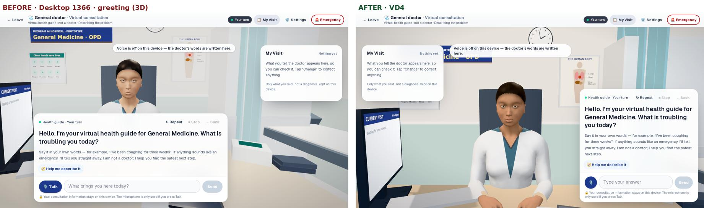
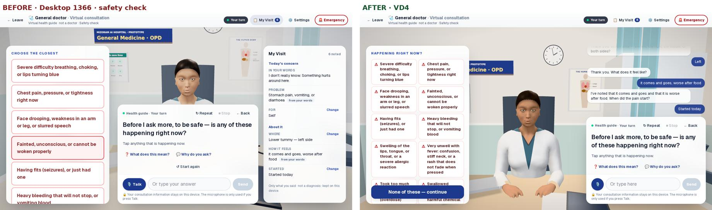
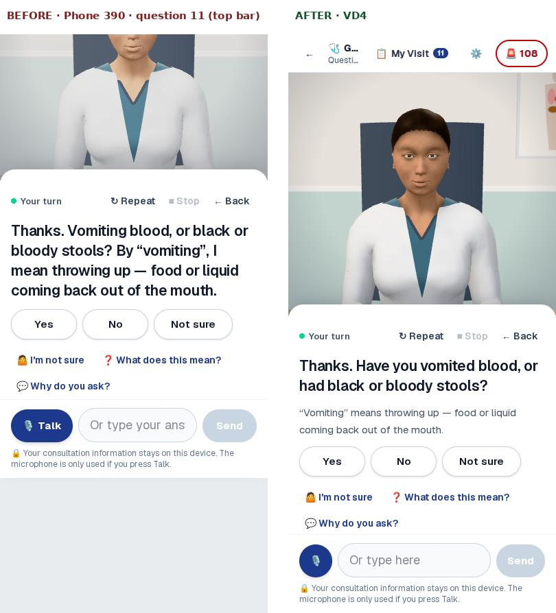
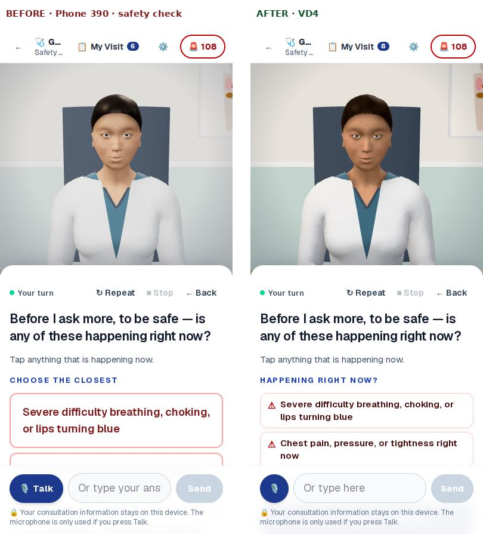
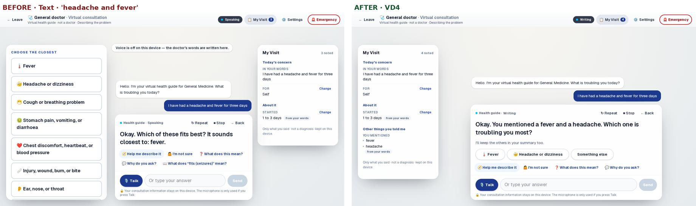
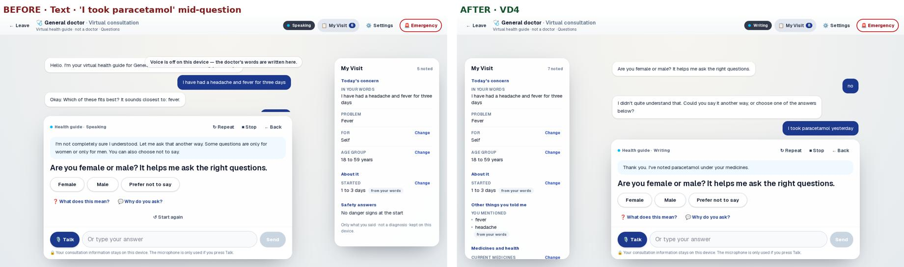
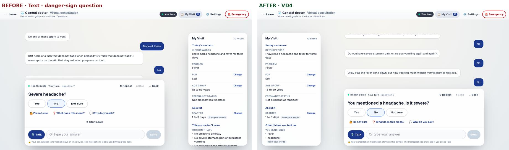

# VD4 — Next-generation Virtual Doctor: report

Four passes on the live experience, each ending with typecheck, lint,
the full unit and browser suites, a production build, and a push.
Synthetic patients only. Measurements are from this build environment:
headless Chromium with **software WebGL (no graphics chip)**.

Software-tested is not clinically validated. Nothing here has clinical
sign-off yet (0 of 310 clinical items, 0 of 10 government items).

## Before / after (same scripted patients, same steps)

| | |
|---|---|
|  | Desktop 1366: the doctor is framed unobstructed between My Visit (left) and the conversation column (right); before, the question card covered her body. |
|  | Safety check: compact two-column list with a sticky "None of these"; the transcript shows what was said; "comes and goes, worse after food" is noted back. |
|  | Phone, question 11: before, the whole room had slid up and the top bar with **108** was gone; after, it stays, and the question is in plain words with the meaning written under it. |
|  | Phone safety check. |
|  | "Headache and fever": before, every problem group; after, "You mentioned a fever and a headache. Which one is troubling you most?" |
|  | "I took paracetamol yesterday" at an unrelated question: before, "I didn't understand"; after, noted and said back. |
|  | Danger-sign question: before, "Severe headache?"; after, "You mentioned a headache. Is it severe?" |

The audit that ranked the 20 defects is in `VD4_AUDIT.md`; the BEFORE
screenshots for it are in `vd4/before-*.jpg`.

## Major architectural changes

1. **Patient memory layer** (`app/lib/consultMemory.ts`, `learn()` in
   `consultation.ts`). Symptoms, medicines, conditions, allergies, pattern
   and modifiers are extracted from every message, with denials removed
   first. It never touches urgency fields, which is tested. The safety
   checks read every message before it.
2. **Spoken-question layer** (`app/lib/consultSpeech.ts`). 120 danger-sign
   rules have spoken forms ("you" and "they") and a few refer back to what
   the patient mentioned. The written rules are unchanged. The spoken
   forms are in the clinical review export next to each rule.
3. **Spatial layout.** Conversation column on the right (transcript and
   subtitles, then question and answers); tools and My Visit on the left;
   the camera frames the free space between.
4. **Director contract.** The ten states are each tied to a real event, and
   the face never contradicts the moment (tests).
5. **Sign-offs module** (`lib/review/signoffs.ts`). Pages show an item's
   true review status; the health-information card no longer claims
   "reviewed".

## Doctor improvements (model v11)

- **Baked ambient occlusion** (Embree, 64 rays per vertex): shading under
  the chin, at the collar, round the eyes and inside the mouth.
- **Hairline cut into fine strands** by an alpha strand texture and a
  vertex-alpha fade, replacing the hard "helmet" edge.
- **Ivory, set-back teeth**: no white line between the lips at rest.
- **Hands** deeper and warmer, to match the face.
- **Neutral tone mapping**, chosen by side-by-side comparison with ACES and
  AgX: truer skin and room colours.
- **Expressions**: no hint of a smile while concerned or in an emergency.
- **Lighter clothing materials** below the high quality level.

Tried and removed because they looked worse: hair cards along the hairline
(a jagged fringe) and lapel geometry on the coat (grey zigzags on the
coarse helper mesh).

## Consultation improvements

- **Two problems in one sentence** → asks which matters most, naming only
  those two, in the patient's own words.
- **Facts volunteered at any question** are noted and said back, then the
  same question is asked again. Later questions build on them ("You
  mentioned paracetamol. Are you taking any other medicines?").
- **Danger-sign questions in everyday English**, with references back to
  what was said. Word meanings are written under the question, not read
  out each time.
- **Repeated "I don't understand" at the start** → the body map, one step
  at a time.
- **Two misreadings found by the 25-turn test and fixed**:
  - "I'm diabetic" at the female/male question was recorded as **male**.
  - Any number at the age question was taken as an age ("I took 2
    tablets" → 2 years).
- **Phone**: the top bar with **108** can no longer scroll away (proven:
  the new test fails on the old code); notices hide while typing; the
  question stays above the keyboard.
- **Summary**: urgency and where to go come first. "Start again" moved into
  Settings behind a confirmation.

## Tests (actual results, this build)

- Unit and safety: **571 passed** (545 before VD4). New:
  - `vd4-conversation.test.ts` (18 tests): memory, two problems,
    volunteered facts, spoken-form meaning check, age and sex parsing,
    overdose still opens Emergency Mode.
  - `director-contract.test.ts` (8 tests).
- Browser: **171 passed, 3 skipped by design** (174 total). New:
  - A 25+ turn consultation on desktop and phone.
  - Typing never scrolling the room away.
  - The phone keyboard test now checks the settled layout.
- Conversation accuracy harness, regenerated:
  - **0 wrong and 0 unsafe recordings**.
  - Understood first time: 100% training, 98.8% held-out A, 88.5% held-out
    B (never tuned against).
  - 1,500 messy simulated visits: **0 summary mismatches**.
- Typecheck clean; lint 0 errors; production build OK.
- Accessibility: axe checks on the room pages pass (in the browser suite).
- Security:
  - `npm audit --omit=dev`: **0 vulnerabilities**, after patching
    `source-map-js` 1.2.1 → 1.2.2.
  - Dev-only tooling (vitest, eslint) still has 8 advisories that need
    major upgrades. Not in the production bundle.

## Performance (measured, 1366×768, software WebGL)

| Display | Downloaded | Frame rate | Send → next question |
|---|---|---|---|
| Text only | 334 KB | 60 fps | ~50 ms |
| 2D guide | 334 KB | 60 fps | ~45 ms |
| 3D low | 810 KB (model 203 KB) | 6.3 fps | ~140 ms |
| 3D medium / high | 810 KB | 1.4–1.5 fps | ~800–970 ms |

Voice (instrumented speech engine; a real device's voice adds its own
start-up delay; **no real voice was tested**):
- Stop → speech cancelled: 0 ms.
- Talk → speech cancelled: 0 ms.
- Typing → speech cancelled: 13 ms.
- Emergency words → emergency line spoken: 16 ms, with no pause.
- Send → doctor starts speaking: 631 ms.
- The mouth returns to rest within about 100 ms of speech stopping
  (morph smoothing).

## Remaining issues (honest)

- **Realism**: the doctor is still a procedural CC0 figure; the coat is a
  plain white shape. MakeHuman's own CC0 hair and skin-texture assets are on
  a host this environment cannot reach.
- **Real-device performance is unmeasured.** In software rendering, 3D
  medium and high are not usable ("auto" steps down by itself). A low-cost
  Android phone must be tested before any pilot.
- The safety checklist has up to 14 danger signs; on a 1366×768 screen the
  last row scrolls under the sticky "None of these" button.
- Understanding on never-tuned phrasing is 88.5%; the rest is asked again.
  It is never recorded wrongly.
- **Approvals still needed** (no code change can replace these):
  - Clinician review of 310 items, now including the spoken forms.
  - Government verification of 10 data items.
  - Privacy and legal approval.
  - Mizo translation.
  - An official video service for live consultations.

## Next five highest-impact improvements

1. **Clinician review session** on the 120 danger-sign rules with their
   spoken forms side by side. Nothing should be piloted before this.
2. **Real-device profiling** on a low-cost Android phone and a mid-range
   laptop, then set the automatic display levels from real numbers.
3. **Bring in MakeHuman's CC0 hair and skin textures** (or a licensed scan)
   from a network that can reach them: the biggest remaining realism gain.
4. **Mizo language**: phrase list and spoken forms with qualified
   translators, reviewed together with the English.
5. **Raise understanding on never-tuned phrasing** with a new held-out set
   from real (consented, anonymised) pilot phrasing, never tuned against.
