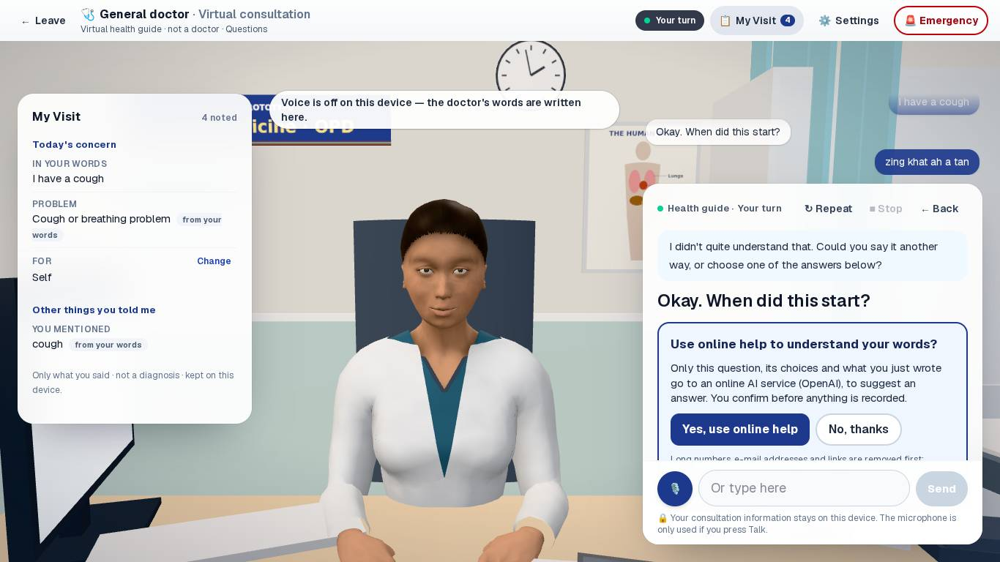
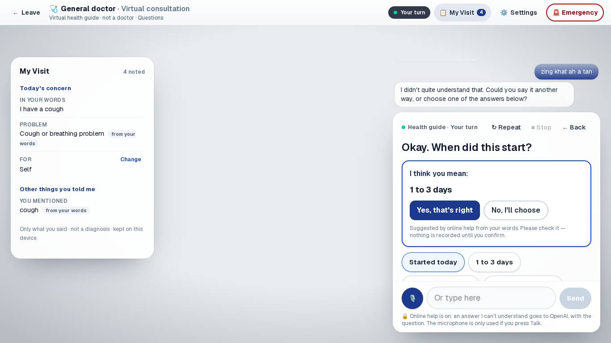
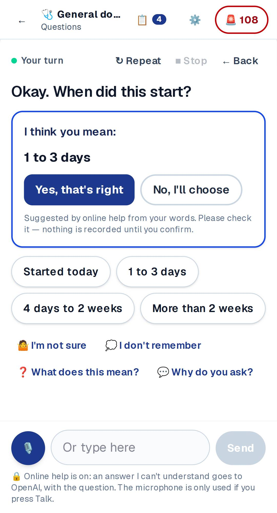
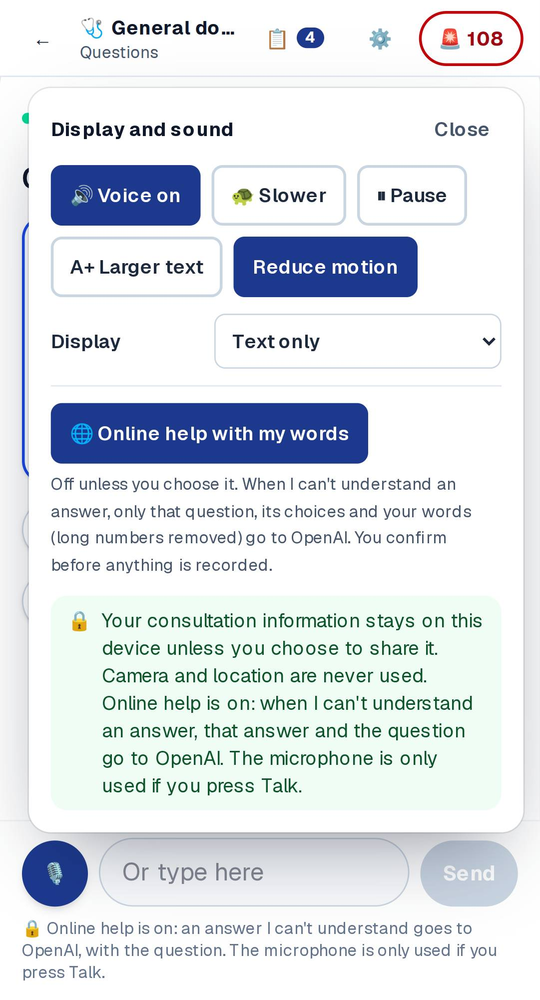

# VD5 — Online help understanding words (OpenAI): report

The first use of an external AI API in the prototype. It is **built,
tested with a stand-in, and switched off**. Turning it on needs an OpenAI
key on the server and, before any real patient uses it, privacy and legal
approval.

Software-tested is not clinically validated. The real model has **not**
been measured (no key in this environment).

## What it does

The on-device engine understands most answers. On never-tuned phrasing it
understands 88.5% the first time, and the rest are asked again, never
recorded wrongly. VD5 helps with the rest: when the device cannot
understand an answer to a question with choices, an online model suggests
which choice was meant.

| | |
|---|---|
|  | The device did not understand "zing khat ah a tan". It asks, in plain words, whether to use online help, and says what is sent and to whom. |
|  | After "Yes": "I think you mean: 1 to 3 days". Nothing is recorded until "Yes, that's right". |
|  | Phone. The privacy line says online help is on. |
|  | Settings: on or off at any time, with a one-line explanation. |

## Safety and privacy design

- **The deterministic engine stays in charge.** `converse()` runs
  unchanged: danger signs first, then corrections, explanations and the
  device's own understanding. Only an `unclear` result on a question with
  choices can go online. Emergency words open Emergency Mode on the device
  and never reach the network (tested).
- **Never online:** confirmations of danger words, contradictions with
  earlier answers, emergencies, free-text questions (medicines, allergies,
  the first description).
- **The model can only name choices on screen.** This uses Structured
  Outputs with an `enum` of the option ids. The same policy runs on the
  server and in the room (`acceptReply`):
  - exactly one choice for a single answer;
  - "None of these" never mixed with others;
  - a reassuring answer ("No", "None of these") to a danger-sign question
    is suggested only when the model is certain. A worrying answer is
    always suggested.
- **The patient confirms.** "I think you mean …. Is that right?" leads to
  "Yes, that's right" or "No, I'll choose". The suggestion itself records
  nothing.
- **Minimum data:**
  - Sent: one question, its choices, and the words for that one answer.
    Long numbers (phone, Aadhaar, PIN), e-mail addresses and links are
    removed on the device and again on the server.
  - Not sent: earlier answers, summary or identifiers.
  - Requests use `store: false`.
  - The route logs and keeps nothing. It holds an in-memory per-address
    count for a minute (20 per minute per address, 600 per minute for the
    site).
- **Consent:**
  - Off by default.
  - Asked at the moment it would help, at most twice a visit.
  - "No, thanks" means never this visit.
  - Held in memory only, and can be turned off in Settings.
- **Failure is silent and safe.** Offline, timeout (8 s), refusal, no key,
  or a reply outside the policy all lead to the device's own clarification
  line, and the visit carries on.
- **The privacy test** allows exactly one network file in the consultation
  (`consult-room/online.ts`). It may only call this site's
  `/api/understand`, and only one place in the room may use it.

## Architecture

| Piece | File |
|---|---|
| Contract: what is sent, what may come back, the policy, the prompt and the schema | `app/lib/understand.ts` |
| Server route: availability, validation, size limits, cross-site refusal, rate limit, no logs | `app/api/understand/route.ts` |
| OpenAI call: official `openai` SDK, Chat Completions, strict JSON schema, `store: false`, no retries, 7 s timeout | `app/api/understand/model.ts` |
| Room: offer card, Settings switch, "Checking what you meant…", suggestion card, cancellation on any new answer | `consult-room/ConsultationRoom.tsx`, `consult-room/online.ts` |
| Clinical review item (the policy and the model's instructions) | `TP-online-understanding` in `docs/CLINICAL_REVIEW.md` |
| Live measurement | `scripts/understand-eval.ts` |

Settings (server-only; see `docs/DEPLOYMENT.md`):

- `AI_UNDERSTANDING=on`
- `OPENAI_API_KEY` (secret)
- optional `OPENAI_MODEL` (default `gpt-5.4-mini`)
- optional `OPENAI_REASONING_EFFORT` (default `low`)

## Tests (actual results, this build)

- Unit and safety: **592 passed** (571 before VD5).
  - 20 new in `online-understanding.test.ts`:
    - redaction;
    - what may be sent, and that free-text, confirmation and emergency
      steps are never sent;
    - server re-validation;
    - the reply policy;
    - suggestions and the recorded value;
    - emergency words never become an "unclear" answer;
    - prompt injection inside the reply;
    - the OpenAI call (strict schema, `store: false`, roles), with refusals
      and errors handled;
    - the route: availability, 503 when off, 403 cross-site, 400/413/415
      bad requests, the server-side policy, and the rate limit.
  - 1 new in `integrity.test.ts`: the single network exception.
- Browser: **5 new tests × desktop and phone, all passing**, using a
  stand-in for `/api/understand`:
  - the offer appears before anything is sent;
  - only the question, choices and redacted words are sent;
  - nothing is recorded until confirmed;
  - "No, thanks" and "No, I'll choose";
  - emergency words never reach the network;
  - failures carry on;
  - when the site has it off (the default), it is never offered.
- The built route with a fake key: `GET` → `{"available":true}`; `POST` →
  502 `failed` in 75 ms (the request to OpenAI fails); cross-site `POST` →
  403. Nothing was logged.
- `npm audit --omit=dev`: 0 vulnerabilities (with `openai` 7.31.0).

## Not measured (honest)

- **The real model's accuracy and speed.** There is no key here. Run
  `npx tsx scripts/understand-eval.ts` with a key; it costs a few dozen short
  requests. It covers the 15 held-out phrasings the device does not
  understand today (`--dry` lists them). It reports correct, wrong and
  missing suggestions, and wrong *reassuring* suggestions to danger signs,
  where the target is 0.
- **Mizo and mixed-language replies.** The model is told replies may be in
  Mizo, but there is no reviewed Mizo test set. Qualified translators need
  to supply one before anyone relies on it.
- **The default model and effort** (`gpt-5.4-mini`, `low`) were chosen for
  speed and cost, not measured. Re-check with the evaluation script.

## Needed before switching it on for real patients

1. Privacy and legal approval. It sends a patient's words, which are health
   information, to a processor outside India. This includes the Digital
   Personal Data Protection Act, 2023, and needs a data processing
   agreement.
2. An OpenAI project with a spending limit. Check the current data
   retention terms, and zero data retention if available.
3. Clinical review of `TP-online-understanding`.
4. A live evaluation run with the chosen model: 0 wrong reassuring
   suggestions, and its accuracy and latency recorded here.
