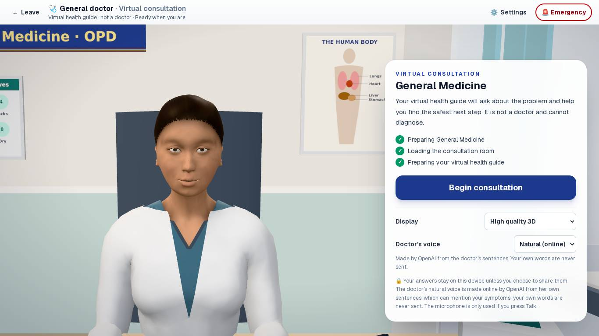
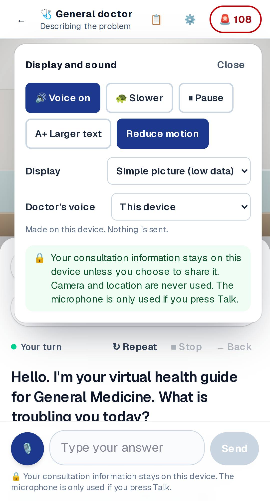

# The doctor's natural voice (OpenAI): report

The virtual doctor can now speak in a natural voice made by OpenAI's
text-to-speech, using the project's paid key on the server. It is on when
`OPENAI_API_KEY` is set on the host. With no key, the doctor uses the device
voice as before.

**Not yet heard or measured with the real voice:** this environment has no
key. Everything below was tested with a stand-in that returns silent audio.

## How it works

| Piece | File |
|---|---|
| What may be sent, the privacy filter, tones | `app/lib/doctorVoice.ts` |
| Server route: key, validation, size limits, cross-site refusal, rate limit, no logs, audio streamed back | `app/api/voice/route.ts`, `app/api/voice/tts.ts` |
| Player in the room: Web Audio, fetching ahead, memory for Repeat, fallback | `app/ai-hospital/consult-room/naturalVoice.ts` |
| Lip sync fitted to each sentence's real audio length | `doctor/lipsync.ts` (`fit`) |

- **Voice:** default `gpt-4o-mini-tts` with the `marin` voice. It is
  instructed to sound like a calm, warm woman doctor in Mizoram speaking clear
  Indian English. There are "serious" and "urgent" tones for concern and
  emergencies. Model and voice can be changed with environment variables.
- **No gaps:**
  - When the doctor starts a line, everything still to be said is fetched at
    once, so sentences follow each other.
  - Repeat plays from memory.
  - The first sentence of each reply waits for the network. The doctor shows
    "Thinking…" meanwhile.
- **Phones:** sound is unlocked by the "Begin consultation" tap.
- **Controls:** Pause, Stop, Slower (a slower generated pace) and Mute all
  work.

## Safety and privacy

- **Emergencies never wait.** The emergency line's audio is fetched when the
  consultation begins. If it is not ready, the device's voice says it at
  once. Tested in unit and browser tests.
- **Only the doctor's own sentences are sent.** The patient's typed or spoken
  words never leave the device: a sentence that repeats them is spoken by the
  device voice. A repeat is a whole message, or four words in a row.
  - The tests check this, and fail if the filter is removed.
  - The doctor's sentences can still mention symptoms ("You mentioned a
    headache"). This is disclosed before the visit and on the privacy page.
- **Choice:** before beginning, and in Settings, the patient can pick
  "Natural (online)" or "This device". "This device" sends nothing.
- **Failure:**
  - Any failure means the device voice says that sentence.
  - After three failures in a row, the natural voice stops for the visit,
    and a short notice tells the patient.
- **The route** keeps and logs nothing; the audio is not cached. A
  per-address limit protects the key: 120 sentences a minute.
- **The key** is only on the server. It is not in the browser bundle
  (checked), the repository, or any `NEXT_PUBLIC_` variable.

| | |
|---|---|
|  | Before beginning: the voice choice and what it means. |
|  | Phone, Settings: switch to the device's voice at any time. |

## Tests (this build)

- Unit and safety: 21 new tests in `natural-voice.test.ts`.
  - The privacy filter, request validation and tones.
  - The OpenAI call: model, voice, instructions, MP3, pace; errors handled.
  - The route: availability, 503 / 502 / 403 / 400 / 413 / 415, and the rate
    limit.
  - The player:
    - only the sentence is sent;
    - the patient's words are never sent, not even when fetching ahead;
    - an emergency goes to the device voice at once;
    - three failures stop the natural voice;
    - Stop means nothing plays later;
    - nothing is fetched twice.
  - Lip sync follows the audio length.
  - 1 new privacy check: the only network call in the consultation goes to
    `/api/voice`.
- Browser: 4 new tests × desktop and phone.
  - The greeting and the emergency line are sent; the patient's words never
    are.
  - Choosing "This device" stops sending.
  - An emergency opens at once.
  - Repeated failure shows the notice.
  - With no key (the default), nothing changes.

## To switch it on

1. Vercel → Project → Settings → Environment Variables. Add
   `OPENAI_API_KEY` (Production) with the paid key, then redeploy. Do not put
   the key in the code or in a chat.
2. Set a monthly spending limit on the OpenAI project.
3. Listen on a real phone. If preferred, try `OPENAI_TTS_VOICE` = `coral`,
   `sage` or `shimmer`.
4. Before real patients: privacy and legal approval. The doctor's sentences
   can mention symptoms and are processed outside India (Digital Personal
   Data Protection Act, 2023), so a data processing agreement with OpenAI is
   also needed.
